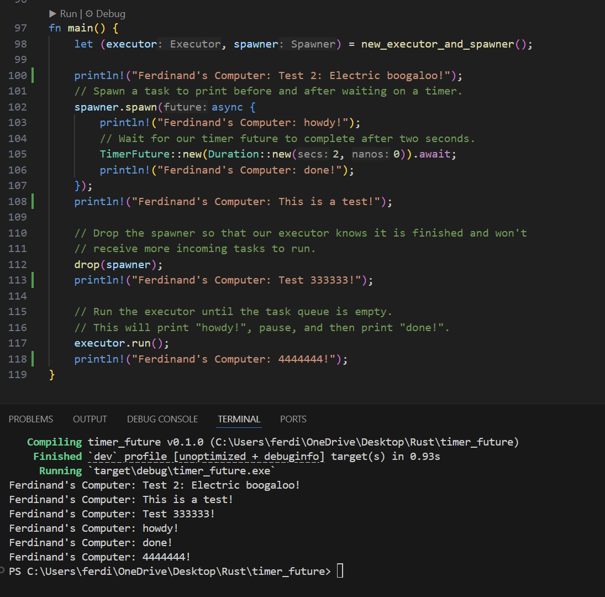
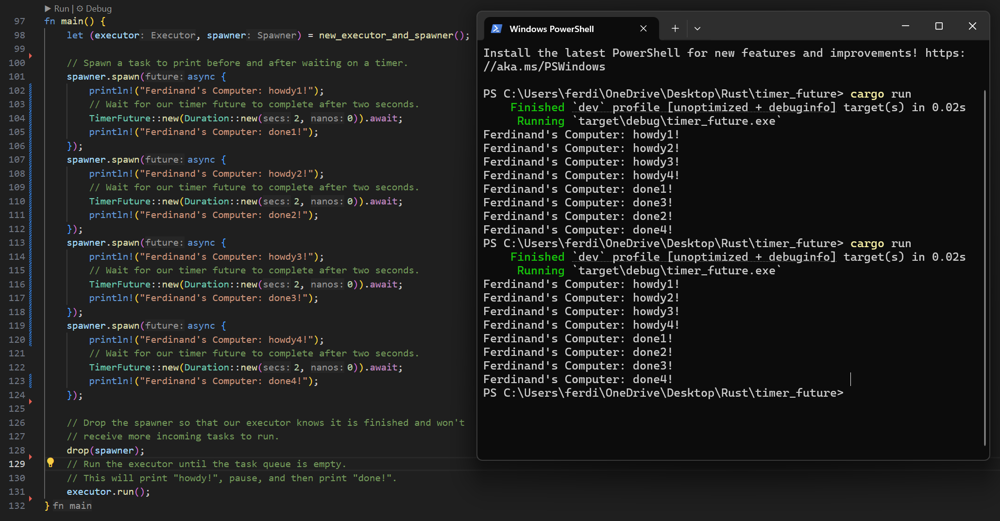
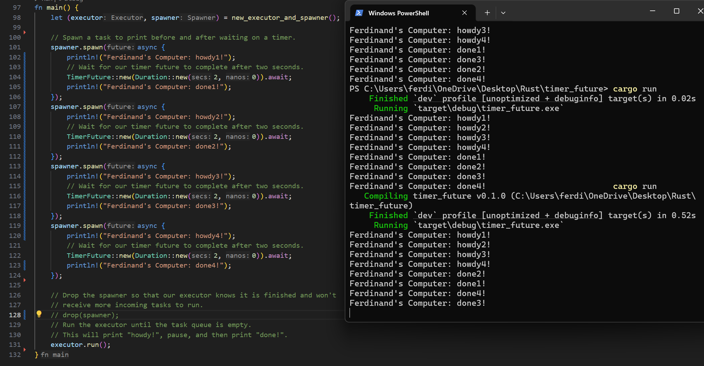
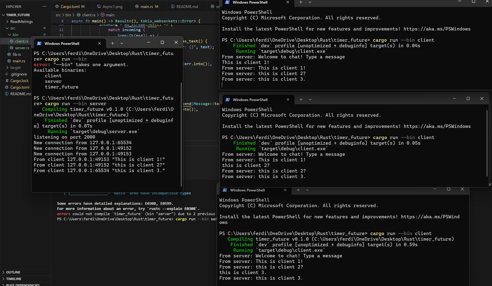
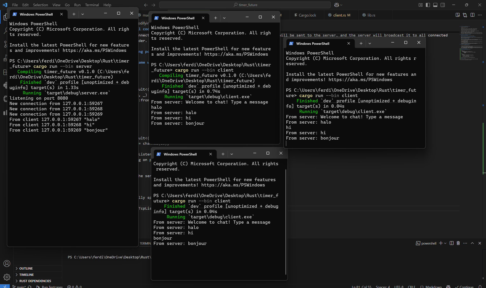
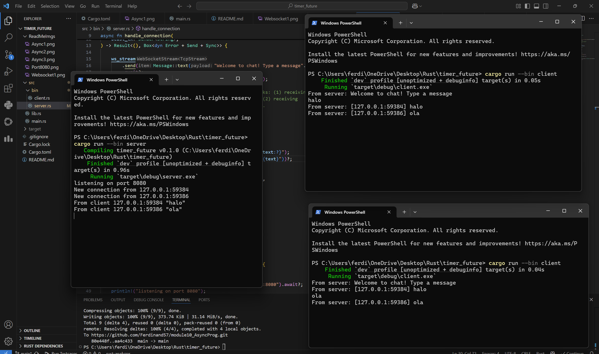

## Experiment 1.2: Understanding how it works.

Explanation:

"println!("Ferdinand's Computer: Test 2: Electric boogaloo!");" happens synchronusly

spawner.spawn is creating an asynchronus recipe that will be run by executor later

"println!("Ferdinand's Computer: This is a test!");" happens synchronusly

drop(spawner). Tell the executor that there's no more spawner related to it beyond this point.

"println!("Ferdinand's Computer: Test 333333!");" happens synchronusly

executor.run() is running all the async task that is related to it. It only run code within the async spawner itself, the reason it doesn't re run "Ferdinand's Computer: This is a test!" is because it's outside the async code

when the executor is done running all it's related async task, the next "println!("Ferdinand's Computer: 4444444!");" is executed

## Experiment 1.3: Multiple Spawn and removing drop

### What is the effect of spawning? 

When we spawn, we create a task that will be run later by an executor

### What is the spawner for, what is the executor for, what is the drop for?

Spawner is a way to make a new instance of async task, executor is to run all of the task related to it, the drop is to establish end and ownership between the spawned instance of async task and and it's executor

### What is the correlation of all of that?

Think of it like a kitchen, when we spawn an async, we start to write the recipe(s), when we execute, we start to tell the chef all the pre-made recipe(s) until we drop, when we drop, we tell the chef that they don't have to listen for any recipe(s) anymore

The images above shows what happened if we have multiple recipes on the same executor session, the chefs will cook every recipe that is related to that executor session, the chefs speed might be different

The images above shows what happen when we never tell the chef to stop listening for any new recipes, it will be stuck on a listening loop where it doesn't go past that listening session and continue to the next synchronus instruction after executor line

## Experiment 2.1: Original code, and how it run

The image above shows the server and 3 client, the server listen for connection and data sent from all it's client, and when the server receive a message from one client, it will send it to all connected client including the sender

to run it, open command prompt or powershell for each instances of client and server, then do cargo run --bin server for the server, and cargo run --bin client for the client, once the client connects, it gets a welcome message, after that, whatever entered will be sent to the server, and the server will broadcast it to all connected clients, including the sender. so everyone sees the message.

## Experiment 2.2: Modifying port

### Is it also using the same websocket protocol? 

client.rs

    #[tokio::main]
    async fn main() -> Result<(), tokio_websockets::Error> {
        let (mut ws_stream, _) =
            ClientBuilder::from_uri(Uri::from_static("ws://127.0.0.1:8080"))
                .connect()
                .await?;

server.rs

    [tokio::main]
    async fn main() -> Result<(), Box<dyn Error + Send + Sync>> {
        let (bcast_tx, _) = channel(16);

        let listener = TcpListener::bind("127.0.0.1:8080").await?;
        println!("listening on port 8080");

Yes, both the client and the server is using the same websocket protocol

### Where is it defined?

In the client it spesifically specified the use of websocket using "ws://127.0.0.1:8080"

while the server is using TcpListener on the same port

## Experiment 2.3: Small changes, add IP and Port

the following is the comment from the server.rs

    // A continuous loop for concurrently performing two tasks: (1) receiving
    // messages from `ws_stream` and broadcasting them, and (2) receiving
    // messages on `bcast_rx` and sending them to the client.

By reading the above, i assume that by changing the bcast_rx on the code that is referenced by the comment then we can modify what kind of message that is being change